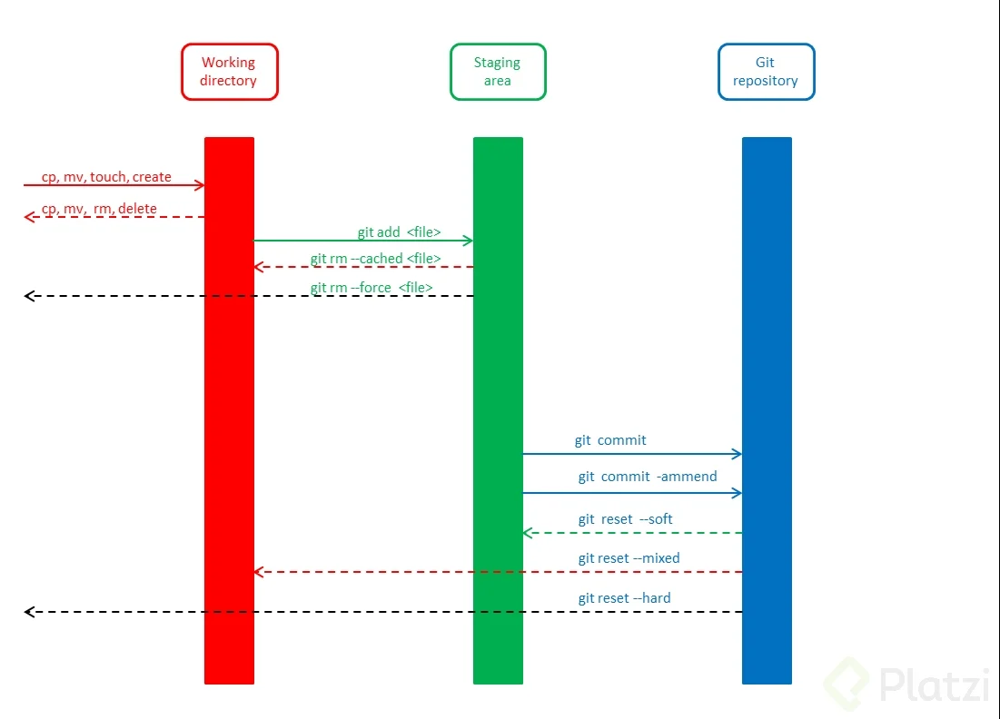

# **Git:**
 ## ***git reset vs git rm***

  Tenemos aquí un par de opciones para "volver en el tiempo" pero debemos tener cuidado, primero veremos el caso del git rm.
 ### ***git rm:***
  Aquí debemos tener en cuenta que podemos usar:
  ### **git rm --cached:**
   Aquí una vez que usamos este comando, los archivos serán eliminados de git y del staging, pero los mantiene en el disco duro, es como si le dijeramos que queremos reversar el git add, sencillamente los archivos pasan de tracked a untracked.

    git rm -cached
  ### **git rm --force:**
   En este nuevo caso, los archivos serán eliminados de git y del disco duro, pero como git siempre guarda como una "copia de seguridad" de todo, podemos igualmente regresar en el tiempo y recuperar los archivos, pero se necesitaran comandos un poco más avanzados.

    git rm --force
 ### ***git reset:***
  Para este comando tenemos tres posibilidades:
  ### **git reset --soft:**
   Es la manera más segura de volver en el tiempo, aquí sencillamente volveremos a una versión anterior pero guardando los cambios que tenemos en el staging, pudiendo acceder a estos por medio de un commit anterior.

    git reset --soft
  ### **git reset --hard:**
   Aquí tenemos que tener más cuidado, es la opción más usada pero la más peligrosa también, aquí literal si la usamos, nos va a devolver a una versión anterior, pero se van a borrar todos los cambios que pudiesemos haber hecho antes.

    git reset --hard
  ### **git reset HEAD:**
   Con este comando podemos hacer una reversión de los cambios que tenemos en el staging, así, no eliminamos ningún documento ni nada por el estilo, lo único que hacemos es devolver los archivos del staging a nuestra área de trabajo y así podemos actualizar los documentos para volverlos a commitear.

    git reset HEAD
 ## ***git log:***
  Este comando lo usamos para ver todos los cambios y su respectivo número de referencia a esos cambios:
  ### **git log --stat:**
   Por medio de este comando podemos ver no sólo los distintos commits que se hicieron al repositorio sino también en que han cambiado en sentido de bits el uno del otro. Es como un detallado.

    git log --stat
 ## ***git show:***
  En este caso podremos encontrar todos los cambios que se hicieron dentro de los archivos de texto plano, lo que se eliminó y lo que se colocó.
   
    git show
# **GitHub:**

 Aquí tenemos el repositorio remoto donde van a estar almacenados todos los archivos que queremos usar y compartir con otras personas, principalmente usado cuando trabajamos con más personas en un mismo proyecto. A continuación veremos algunos comandos para trabajar con git y GitHub.
 ## **Comandos:**
### **git add:**
  Este comando es bien conocido porque por medio de este vamos a subir los archivos que queremos al staging, podemos usar el . para subir todos los archivos o el nombre de archivo para sólo subir ese archivo. 

    git add .
    git add <file>
 ### **git commit:**
  Por medio de este comando vamos a commitear los archivos que ya tenemos en el área de staging, aquí ya pasan a estar en el repositorio local, o sea que ya podemos tener el versionado de nuestro proyecto y ver las distintas versiones con los cambios y todo lo que se hizo. No debemos olvidar usar el -m y añadir el comentario de lo que se hizo ya que es una buena práctica.

    git commit -m "Comentario"
 ### **git push:**
  Aquí se viene la unión entre git y GitHub, una vez que ya tenemos comiteados neustros cambios, vamos a subir nuestros cambios a GitHub, esto lo hacemos por medio del comando git push, esto nos va a pushear o empujar los documentos a GitHub y todas las personas en nuestro proyecto van a poder ver los cambios que hemos realizado.

    git push
    git push <url>
 ### **git fetch:**
  Cuando alguna persona hace una actualización al proyecto y nosotros queremos traer esa actualización al repositorio local (PILAS, al repositorio LOCAL, no al directorio de trabajo) usar git fetch para esa actualización.

    git fetch
 ### **git merge:**
  Con este comando haremos que las actualizaciones que están en el repositorio local pasen al directorio de trabajo, es copiar los archivos o borrar los que el otro colaborador borró.

    git merge
 ### **git pull:**
  Así como con push mandabamos los cambios al repositorio remoto, aquí lo que estamos haciendo es trayendo los cambios del repositorio remoto al directorio de trabajo y al repositorio local, es como si estuvieran combinados git fetch y git merge en un sólo comando.

    git pull  
 ### **git commit -am:**
  Con este comando vamos a hacer el git add y el git commit en una misma líne de código, esto lo hacemos con archivos a los que se les hizo un git add previamente, o sea que con archivos nuevos no va a funcionar, en esos casos debemos hacer primero el git add y luego si git commit:

    git commit -am "Comentario"
 ## **Ramas:**
  ### **Creación de ramas:**
   Para crear ramas vamos a usar el comando 

    git branch <branch name>
   De esta manera tendremos una nueva rama llamada "branch name", pero igualmente en principio estaremos trabajando en la rama master. Para cambiar esto vamos a usar el comando

    git checkout <branch name>
   Aquí podremos encontrar que estamos trabajando en la rama "branch name". Si hacemos git log en este punto, vamos a ver que el HEAD igualmente va a estar apuntando a cabecera y a master, pero si hacemos un cambio, luego commiteamos el cambio y hacemos git log de nuevo, veremos que ahora si el HEAD va a estar apuntando a la nueva.

   Desde Octubre de 2021 GitHub cambió el nombre de su rama master a main (Principal), así entonces si estamos trabajando en una rama Master, vamos a tener problemas cuando intentemos crear el repositorio en GitHub, así que lo mejor es pasar todos nuestros archivos a una rama Main, esto lo podemos hacer fácilmente con el comando

    git branch -M main
   Aquí ya creamos la nueva rama y vamos a pasar todos los documentos que tenemos en la rama en al que estamos parados a la nueva rama. Tener en cuenta que para este caso la llamamos main, pero puede tener cualquier otro nombre.
  ### **Manejo de ramas:**
   Aquí vamos a aprender a movernos por medio de las ramas que ya hemos creado por medio del comando
    
    git branch nombreDeLaRama
   Cuando ya tenemos varias ramas podemos usar el comando
    
    git show-branch
   Para ver las ramas que existen y el historial de estas. Si queremos ver algo un poco más detallado podemos usar el comando
    
    git show-branch --all
   Hay un comando que Git trae por defecto, por medio de este podemos ver de una forma más visual toda la historia de nuestras ramas. Este comando es

    gitk 
   Pilas, esta es sólo una herramienta, recuerda no usarla mucho, los programadores usamos la consola ya que es más práctica y rápida.

   Debemos tener en cuenta también que podemos enviar las distintas ramas a GitHub, esto lo hacemos pasando a la rama que queremos enviar y pusheándola;

    git pull origin master //Buenas prácticas
    git checkout origin nombreDeLaRama //Cambio de rama
    git push origin nombreDeLaRama //Subimos la nueva rama
 ## **Creando un repositorio remoto:**
   Lo primero que tenemos que hacer en este caso es ir a GitHub y decirle que queremos crear un nuevo repositorio, le ponemos nombre, una descripción pequeña, elegimos si queremos que sea un repositorio público o privado, luego escogemos si queremos ponerle un README (Siempre hay que ponerlo, es una buena práctica) y lo creamos. 

   Después tendremos que subir nuestros archivos que ya hemos trabajado en nuestro computador, aquí hacemos:

    git remote add origin <url>
   Esta url la podemos obtener de GitHub cuando le damos en clonar repositorio.

   Después podemos hacer git remote y tendremos:

    git remote
    origin
   Aquí vemos que se creo el origin u origen de nuestro repositorio nuevo. Luego hacemos

    $ git remote -v
    origin  https://GitHub.com/JuanT1911/FT-M2.git (fetch)
    origin  https://GitHub.com/JuanT1911/FT-M2.git (push)
   Cuando tenemos ese par de origin, vemos que ya tenemos los comando fetch y push y el link a donde va a ir direccionado todo lo que hagamos en este repositorio.

   Ahora vamos a subir nuestro repositorio a GitHub, para hacer esto tecleamos el comando

    git push origin main
   Cuando hacemos esto lo que realmente queremos decir es "Git, por favor pushee o mande al origen la rama main", hay casos en los que ya hay archivos como tal en el origen, principalmente es el caso de los README, entonces lo que va a hacer git es pedir que por favor traiga los archivos del origen para luego mandar todos los archivos al origen. Esto se hace así:

    git pull origin main
   Comúnmente nos saltará un error que va a ser el de que no se permite fusionar (merge) historias no relacionadas (refusing to merge unrelated histories), aquí entonces vamos a solucionar esto con el comando
    
    git pull origin main --allow-unrelated-histories
  
   Después de esto ya podemos usar nuestros repositorios con normalidad y usar el git push y el git pull tranquilos, pilas, conocimos un nuevo estandar de seguridad conocido como SSH, es todo un proceso pero es importante para la seguridad del proyecto, no olvidar aplicar a cada computador donde se trabaje como tal.
  
  ### **Viendo el versionado completo:**
   Ya vimos que podemos ver las versiones de nuestro proyecto con el comando
    
    git log
   Pero también podemos dar unos parámetros distintos para que git nos muestre más cosas, por ejemplo si hacemos:
    
    git log --all
   Nos va a mostrar literalmente todo lo que se ha hecho ya que a veces, dependiendo de como se hacen las colaboraciones con las ramas y otras cosas, puede que no nos muestre todo. Si por ejemplo hacemos:

    git log --all --graph
   Nos va a mostrar las versiones como en una línea de tiempo coloreando de distintos colores las distintas ramas (branches) que se han trabajado. Otro muy útil es cuando ya tenemos muchas versiones, la opción anterior puede ser muy extensa, entonces podemos usar:

    git log --all --graph --decorate --oneline
   Aquí nos va a mostrar como antes, de forma gráfica las versiones y el camino que han seguido pero de manera más corta y resumida.
  ### **Alias:**
   Resulta que como pudimos ver en la última variante que vimos del log, es un comando muy muy largo, entonces podemos usar los tags, como estamos hablando de ramas, podemos asociar todo el proyecto a un arbolito, así entonces podemos hacer:

    alias arbolito="git log --all --graph --decorate --oneline"
   Y sencillamente la próxima vez que queramos usar este comando no vamos a tener que escribir todo el comando sino sencillamente:

    arbolito
   Y con eso será suficiente para que nos muestre el versionado gráficamente y resumido.
  ### **Tags:**
   Aquí vamos a ver por ejemplo cuando ya queremos publicar una versión de nuestro proyecto, entonces por ejemplo lo llamaremos versión 0.1 (v0.1), así que viendo el versionado vamos a tener los hash y el nombre de los commits que nosotros colocamos, pero podemos hacer algo del tipo

    git tag -a version que queramos -m "Tag" hash
    //Por ejemplo:
    git tag -a v0.1 -m "Resultado primeras clases del curso" b93a9a8
   Aunque en principio pareciera que nada hubiese cambiado, vamos a hacer

    git tag
   Y este comando nos va a mostrar todos los tags que tenemos, en este caso sólo tendremos el "v0.1". Si usamos el comando

    git show-ref --tags
   Nos va a mostrar el tag y el hash completo al que hace referencia.

   Pero lo interesante no es que nosotros veamos el tag, en si sería meramente una etiqueta, lo importante es que alguien más lo pueda ver, eso como lo hacemos? Subiendo el tag al GitHub, así la otra persona sabe esa versión a que hace referencia y en que punto se quedó justo ahí.

   Primero debemos hacer un

    git pull origin main
   Y después hacemos
   
    git push origin --tags
   Ahora en nuestro computador y en nuestro Git aparentemente no ha sucedido nada, pero realmente en GitHub hay una pestaña que dice tags, ahora dando click ahí podremos ver los tags que se han puesto y nos mandará a la versión a la que ese tag hace referencia.

   Puede suceder que nos equivoquemos haciendo los tags y depronto creamos un tag que después de un tiempo no tiene sentido o sencillamente ya no lo queramos tener, en ese punto entonces hacemos

    git tag
   Para ver todos los tags y poder ver el nombre que le pusimos al tag que ya no queremos. Entonces hacemos:

    git tag -d nombreDelTag
    git pull origin main //Por buenas prácticas
    git push origin --tags
   Pero como sabemos, Git no borra nada, esto porque ese tag puede ser una referencia a un release, que en caso de habernos equivocado, podemos volver a el, entonces internamente en mi computador no lo voy a tener, pero en GitHub si. Entonces para borrarlo completamente debo hacer el comando:

    git push origin :refs/tags/nombreDelTag
   Esto después de haber hecho todo lo anterior por buenas prácticas. 
  ### **Rebase:**
   Aquí tenemos el caso del rebase, es un comando por medio del cuál, en algún momento creamos una rama porque necesitabamos solucionar un error que teníamos en nuestro programa y luego quisimos juntarla con nuestra rama principal, pero en si queremos que nadie vea ese cambio que hicimos, es como pegar una rama con la otra y no ha pasado nada.

   Pilas porque aunque podemos usarla porque por algo existe, los errores siempre suceden, igual es una mala práctica y no debemos usarla siempre, incluso debería usarse unicamente para repositorios locales, nada de usarlo en repositorios remotos, ya que rebase lo que hace es que altera la historia de lo que se hizo previamente y no vamos a tener un registro como tal de quien hizo que y cuando, entonces PILAS AHÍ.

   Cuando usamos rebase primero debemos hacer rebase en la rama donde hicimos los cambios y luego si hacemos rebase a la rama principal, nada de hacerlo a la inversa porque puede generar una cantidad de conflictos muy grande. Igualmente debemos tener cuidado con usar rebase cuando la rama principal ya haya avanzado demasiado, ya que esto puede generar también muchos conflicto

    git rebase ramaAFusionar
  ### **Git stash:**
   Es muy importante, sencillamente es como guardar los últimos cambios en temporal, esto para que si después necesitas cambiar a otra rama sin enviar los últimos cambios como tal, no puedes hacer checkout así no más ya que se pierde todo, lo mejor que puedes hacer es un git stash, va a quedar todo en un temporal, cambiar de rama y luego volver a la rama anterior y así puedes recuperar los cambios,  puedes también meter los cambios a otra rama con

    git stash branch noombreDeLaRama
   
   O si hiciste algunos cambios que ya no van o que sencillamente rompieron el código, usas git stash, los cambios van a quedar en el temporal y tu vas a quedar parado en el último commit del repositorio y al final usas

    git stash drop
   
   y borra ese temporal y quedas como al principio. También puedes usar
    
    git stash list
   
   para ver los temporales. Para acceder al último stash que hicimos usamos el comando 
    
    git stash pop
   
   Y volvemos a los cambios del último stash. Es muy usado en grupos de trabajo, MUY MUY USADO. Comúnmente se usa cuando los cambios que estás haciendo no ameritaban un rebase sino que estás experimentando como tal.
  ### **Git clean:**
   Este comando lo usamos cuando tenemos archivos no deseados en nuestro repositorio y los queremos eliminar, el comando

    git clean

   primero arroja un warning, esto ya que en si no sabemos que va a borrar entonces nos dice como "¿Seguro que quiere que borre lo que yo quiero borrar?". Para saber qué va a borrar usamos el comando

    git clean --dry-run
   
   Aquí git nos va a mostrar que archivos va a borrar, si ya estamos seguros que esos son los archivos que queremos que borre usamos el comando 
    
    git clean -f

   Pero pilas, hay archivos que git no nos va a eliminar, básicamente sabe la estructura de nuestro repositorio, o sea que si hay un archivo que el note como extraño va a eliminarlo, por otro lado el solo sabe de archivos, así que si va a alguna carpeta, esta no la va a borrar, entonces si tenemos que hacerlo manualmente, igual que los archivos que nosotros deseamos que ignorara en nuestro archivo .gitignore, aquí también los va a ignorar y también tenemos que eliminarlos nosotros mismos.